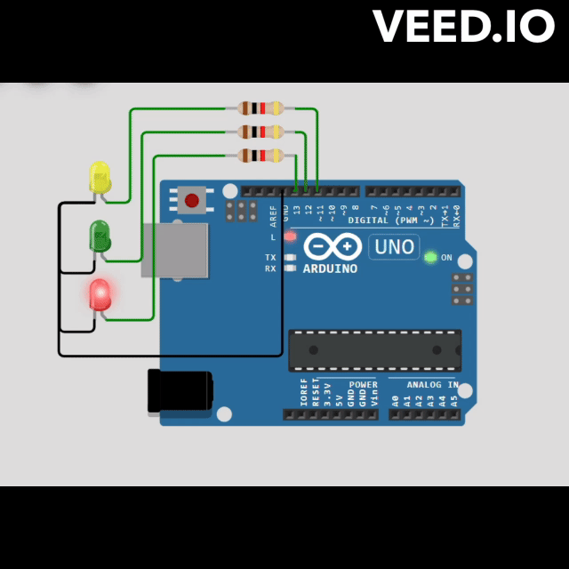
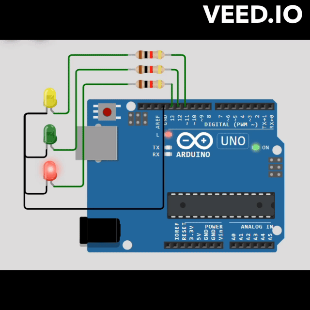

# **MagX Finite State Machine (FSM) Library**

### Introduction
MAGX_FSM is a lightweight and versatile Finite State Machine library designed for Arduino and ESP32 platforms. It provides an intuitive way to manage complex control flows by dividing them into discrete states and transitions. With MAGX_FSM, developers can streamline their code, enhance readability, and facilitate maintainability.

### Features
- **Modular Design**: MAGX_FSM implements a modular design, allowing developers to define custom states and logic tailored to their application requirements.
  
- **Flexible State Handling**: The library offers a flexible mechanism for defining state transitions and executing custom logic associated with each state.

- **Minimal Resource Consumption**: MAGX_FSM is designed to minimize resource consumption, making it suitable for resource-constrained environments like Arduino and ESP32 platforms.

- **Reduced Compile Time Dependency**: By using forward declaration and template classes, MAGX_FSM reduces compile time dependencies and breaks circular dependencies, resulting in faster compilation times.

### Limitation (Under Development)
- **Sequential State Transitions**: Currently, MAGX_FSM initiates state transitions based on the current state. This limitation can affect scenarios where a user wants to suspend a specific task/state, as all subsequent states will not execute. However, ongoing development aims to address this limitation by introducing more flexible transition mechanisms.

### How to Use
1. **Include the Library**: Include the `magx_fsm.h` header file in your Arduino or ESP32 sketch.

2. **Define States and Logic**: Define custom states by extending the `State` class and implementing the `handleState` method. Optionally, create concrete state classes with custom state logic using the `ConcreteState` template class.

3. **Instantiate StateMachine**: Instantiate a `StateMachine` object in your sketch.

4. **Set Initial State**: Set the initial state of the StateMachine using the `setStateWithLogic` method, providing the state name and corresponding state logic.

5. **Run the StateMachine**: Call the `run` method within the main loop of your sketch to execute the current state's logic.

6. **Handle State Transitions**: Implement state transitions and associated logic within the state handling methods.

### Example, blinking LED


```cpp
#include <magx_fsm.h>

//blink LED_BUILTIN by using magx_fsm library

//define state prototypes
void led_off_state(StateMachine &fsm);
void led_on_state(StateMachine &fsm);

 
//define state transition callback for on_state
void on_state_callback(StateMachine &fsm){
  fsm.setStateWithLogic("ON_STATE",led_on_state);
}

//define state transition callbacks for off_state
void off_state_callback(StateMachine &fsm){
  fsm.setStateWithLogic("OFF_STATE",led_off_state);
}


// Define states, in the context of this example, there are two states
// ON state and OFF state
void led_off_state(StateMachine &fsm){
  digitalWrite(LED_BUILTIN,LOW);
  uint32_t OFF_DURATION =1000;
  fsm.waitUntilElapsed(OFF_DURATION, on_state_callback, fsm);
}
void led_on_state(StateMachine &fsm){
  digitalWrite(LED_BUILTIN,HIGH);
  uint32_t ON_DURATION =1000;
  fsm.waitUntilElapsed(ON_DURATION, off_state_callback, fsm);
}


StateMachine fsm;

void setup() {
  pinMode(LED_BUILTIN,OUTPUT);

  //initialize state manually... this can also be trriggered by event or condition
  fsm.setStateWithLogic("ON_STATE", led_on_state);
}

void loop() {
  // put your main code here, to run repeatedly:
  fsm.run();

}
```
### Example, Traffic Lights


```cpp
#include <magx_fsm.h>

// Define pin numbers for LEDs
const int RED_PIN = 13;
const int GREEN_PIN = 12;
const int YELLOW_PIN = 11;

// Define durations for each state in milliseconds
const int RED_DURATION = 1500;   // 1.5 seconds
const int GREEN_DURATION = 1000; // 1 seconds
const int YELLOW_DURATION = 600; // 0.6 seconds


// Function pointers for state logic
void redStateLogic(StateMachine &fsm);
void greenStateLogic(StateMachine &fsm);
void yellowStateLogic(StateMachine &fsm);

// State transition functions
void greenStateCallback(StateMachine &fsm) {
  fsm.setStateWithLogic("GREEN_STATE", greenStateLogic);
}
void yellowStateCallback(StateMachine &fsm) {
  fsm.setStateWithLogic("YELLOW_STATE", yellowStateLogic);
}
void redStateCallback(StateMachine &fsm) {
  fsm.setStateWithLogic("RED_STATE", redStateLogic);
}


void redStateLogic(StateMachine &fsm) {
  // Set red light ON, green and yellow OFF
  digitalWrite(RED_PIN, HIGH);
  digitalWrite(GREEN_PIN, LOW);
  digitalWrite(YELLOW_PIN, LOW);
  fsm.waitUntilElapsed(RED_DURATION, greenStateCallback, fsm);
}

void greenStateLogic(StateMachine &fsm) {
  // Set green light ON, red and yellow OFF
  digitalWrite(RED_PIN, LOW);
  digitalWrite(GREEN_PIN, HIGH);
  digitalWrite(YELLOW_PIN, LOW);

  // Wait in this state for some time
  fsm.waitUntilElapsed(GREEN_DURATION, yellowStateCallback, fsm);
}

void yellowStateLogic(StateMachine &fsm) {
  // Set yellow light ON, red and green OFF
  digitalWrite(RED_PIN, LOW);
  digitalWrite(GREEN_PIN, LOW);
  digitalWrite(YELLOW_PIN, HIGH);

  // Wait in this state for some time
  fsm.waitUntilElapsed(YELLOW_DURATION, redStateCallback, fsm);
}

StateMachine fsm;

void setup() {
  Serial.begin(9600);
  pinMode(RED_PIN, OUTPUT);
  pinMode(GREEN_PIN, OUTPUT);
  pinMode(YELLOW_PIN, OUTPUT);

  // Start with RedState
  fsm.setStateWithLogic("RED_STATE", redStateLogic);
}

void loop() {

  fsm.run(); // Start traffic light operation
}

```


### Importance
- **Code Organization**: MAGX_FSM promotes a structured approach to code organization by encapsulating state logic within discrete state objects.
  
- **Enhanced Readability**: By abstracting state transitions and logic, MagX FSM enhances code readability, making it easier to understand and maintain.

- **Scalability**: MAGX_FSM facilitates the scalability of Arduino and ESP32 projects by providing a scalable mechanism for managing increasingly complex control flows.

- **Resource Optimization**: With minimal resource overhead, MAGX_FSM allows developers to maximize the efficiency of their code, ensuring optimal performance on resource-constrained platforms.

### Conclusion
MAGX_FSM offers a powerful yet lightweight solution for managing control flows in Arduino and ESP32 projects. By leveraging the library's modular design and flexible state handling capabilities, developers can simplify code complexity, improve code organization, and enhance overall project maintainability.
